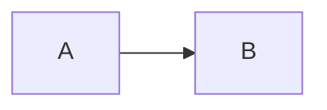
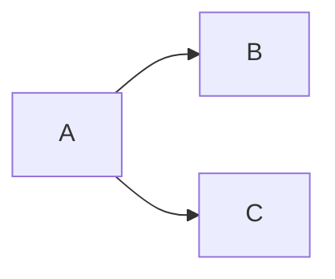
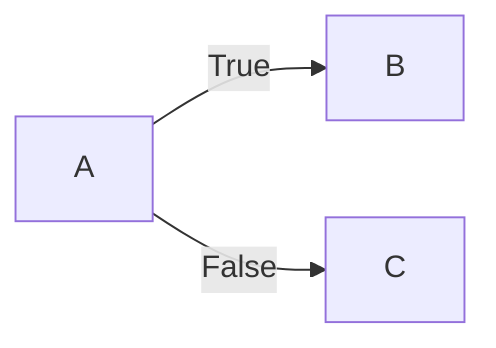
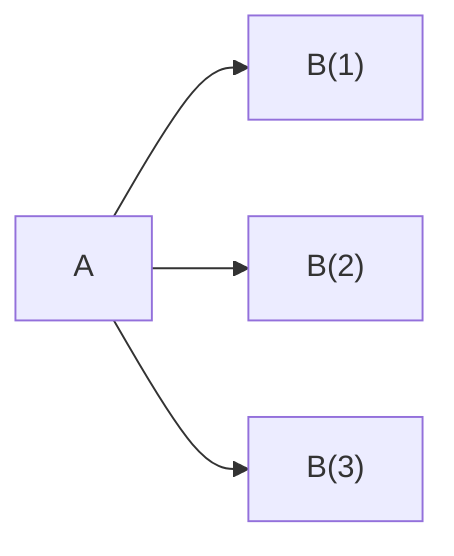
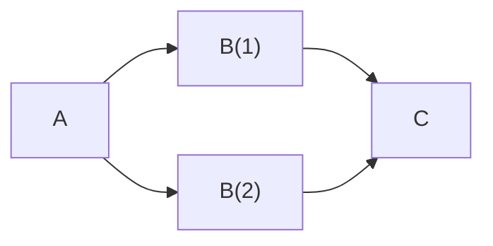
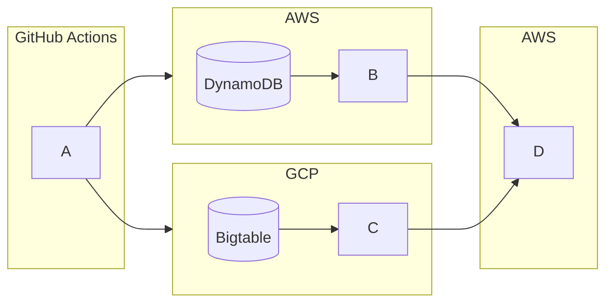

# FaaSr-Functions

This repo contains example FaaSr workflows in Python and R for common use cases.

## Example Functions

### Linear Workflows

The simplest workflow is linear: **Function A** runs, then **Function B** runs. This simple workflow can be used for light workflows.

#### Linear Workflow Example

1. **Function A** pulls data from an external data source.
2. **Function B** runs a data processing job on the data pulled by **Function A**, such as data cleaning or generating CSV or Excel reports.

### Branching Workflows

It is possible to have branching pathways in a workflow, in which case **Function A** invokes **Functions B and C** simultaneously. A branching workflow can be useful when you have more than source of data, each of which require unique logic.

#### Branching Workflow Example

1. **Function A** pulls data from multiple two external data sources.
2. **Functions B and C** simultaneously process data from each data source.

### Conditional Workflows

It may be necessary to conditionally invoke functions in your workflow. A conditional workflow could be particularly helpful for handling cases where a query to an external API yields no or unexpected results.

#### Conditional Workflow Example

1. **Function A** pulls data from an external data source.
   - If data is successfully pulled from the API, the function returns `True`.
   - Otherwise, it returns `False`.
2. **Function B** handles data processing when **Function A** returns `True`.
3. **Function C** handles cases when **Function A** returns `False` (e.g., sending an alert via email or SMS).

### Ranked Workflows

A common workflow pattern is to run multiple invocations of the same function in parallel. A ranked workflow is well-suited for processing chunks of large amounts of data simultaneously.

#### Ranked Workflow Example

1. **Function A** pulls a large amount of data from an external data source and splits the data into three chunks.
2. **Function B** runs with a rank of `3`, with each rank handling one chunk of data in parallel.

### Workflow Syncing

A powerful feature of FaaSr workflows is the ability to sync multiple branches with a single function that waits until each branch completed execution. Syncing a workflow enables validation or cleanup functions that run only after previous functions complete.

#### Workflow Sync Example

1. **Function A** pulls data from an external data source.
2. **Function B** runs with rank `2` to process data in parallel.
3. **Function C** waits for both invocations of **Function B** to complete before validating data processed by **Function B**.

### Using Multiple Compute Servers

An advanced use case for FaaSr workflows is deploying on multiple compute servers across cloud platforms. Workflows with multiple compute servers can be especially powerful when working with cloud-native data sources that span different cloud providers, like Amazon DynamoDB and Bigtable on Google Cloud. This pattern aligns well with security best practices by leveraging temporary credentials (e.g., Lambda execution roles) instead of persistent credentials that would be required to access cloud-native services from external SDKs.

#### Multiple Compute Server Workflow Example

1. **Function A** is triggered on GitHub actions by a merged pull request.
2. **Function B** runs on AWS and pulls data directly from DynamoDB.
3. **Function C** runs on GCP and pulls data directly from Bigtable.
4. **Function D** runs on AWS and performs a final sync between the outputs of **Functions B and C**.

