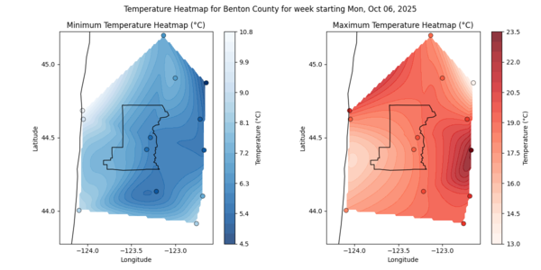
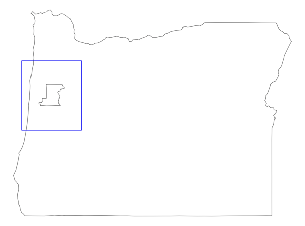

# Geographic Weather Plot Workflow

## Table of Contents

- [Key Topics](#key-topics)
- [Introduction](#introduction)
- [Prerequisites](#prerequisites)
- [Understanding our Data](#understanding-our-data)
- [Writing our Functions](#writing-our-functions)
  - [1. Get our Data](#1-get-our-data)
  - [2. Process our Data](#2-process-our-data)
  - [3. Plot our Data](#3-plot-our-data)
- [Building our Workflow](#building-our-workflow)
  - [1. Set Up our Compute Server](#1-set-up-our-compute-server)
  - [2. Set Up our Data Store](#2-set-up-our-data-store)
  - [3. Add our Functions](#3-add-our-functions)
    - [Get Data Function](#get-data-function)
    - [Process Data Function](#process-data-function)
    - [Plot Data Function](#plot-data-function)
  - [4. Connect our Functions](#4-connect-our-functions)
  - [5. Finalize our Workflow Configuration](#5-finalize-our-workflow-configuration)
- [Download and Invoke the Workflow](#download-and-invoke-the-workflow)
  - [Download the Workflow](#download-the-workflow)
  - [Register and Invoke the Workflow](#register-and-invoke-the-workflow)
  - [View the Output Data](#view-the-output-data)

## Key Topics

- Using timestamp invocation IDs
- Writing functions
- Adding Python packages

## Introduction

The Geographic Weather Plot Workflow demonstrates a geospatial FaaSr use case using timestamped invocation IDs for plotting historic temperature data. It downloads US state and county boundary data and identifies NOAA Global Historical Climatology Network Daily (GHCND) stations in and around a target county. Then, it plots a heatmap of average temperatures from a recent week.

In this tutorial we will build a three-step workflow that automates these tasks and stores intermediate GeoJSON outputs and a final PNG plot to S3.


This tutorial highlights using timestamped invocation IDs and using the workflow's invocation ID to create a unique folder for each workflow run. For example:

```plaintext
bucket-name/
├── 2025-01-01/  # Outputs for workflow run on January 1, 2025
├── 2025-01-08/  # Outputs for workflow run on January 8, 2025
└── 2025-01-15/  # Outputs for workflow run on January 15, 2025
```

Below is an example of the visualization we will be creating:



## Prerequisites

This example function assumes you already completed the FaaSr tutorial ([https://faasr.io/FaaSr-Docs/tutorial/](https://faasr.io/FaaSr-Docs/tutorial/)) and have the necessary repositories and configuration set up. This tutorial will use the FaaSr/FaaSr-Functions repo as the function code source repository, but you may use your own repository as you follow along.

## Understanding our Data

For this tutorial, we are working with two data sources: the [NOAA Global Historical Climatology Network Daily (GHCND) dataset](https://www.ncei.noaa.gov/products/land-based-station/global-historical-climatology-network-daily) and [US Census Bureau Cartographic Boundary Data](https://www.census.gov/geographies/mapping-files/time-series/geo/carto-boundary-file.html).

> ℹ️ Please refer to the **Understanding our Data** section of the [Weather Visualization Tutorial](../WeatherVisualization/README.md#understanding-our-data) readme for details on the GHCND dataset.

To create a geographic plot, we will use the GHCND [inventory metadata](https://www.ncei.noaa.gov/pub/data/ghcn/daily/ghcnd-inventory.txt) to locate stations nearby our region of interest. Inspecting this file, we can see we have station IDs, geographic coordinates, variables, and the start and end years of data collection, for example:

```plaintext
Station ID    Latitude  Longitude   Data    Start   End
--------------------------------------------------------
USC00351862   44.6342   -123.1900   TMAX    1893    2025
USC00351862   44.6342   -123.1900   TMIN    1893    2025
```

The US Census Bureau Cartographic Boundary Data contains boundaries for states, counties, congressional districts, etc. We will use the state and county geographic boundary data to select our stations and for plotting. For this tutorial, we will use Benton County, Oregon.

## Writing our Functions

### 1. Get our Data

This first function in our workflow will pull the US Census Bureau boundary data and the GHCND inventory metadata, then upload the geographic data needed for the rest of our workflow:

- `County.geojson`: The boundary data of our county of interest.
- `OuterBoundary.geojson`: An outer boundary used to select our stations.
- `State.geojson`: The boundary data of the state containing our county.
- `Stations.geojson`: The coordinates of each station, which we will use for our visualization.

The complete function can be found in [01_get_data.py](./python/01_get_data.py).

First, we will write our imports:

- `datetime`: We will use this to get the current year.
- `geopandas`: A library for working with tabulated geographic data.
- `pandas`: A library for working with tabulated data, which geopandas is based on.
- `requests`: We will use requests to download data from public URLs.
- `faasr_log`: This will write log outputs to S3.
- `faasr_put_file`: We will use this function for storing our output data on S3.
- `faasr_invocation_id`: Retrieves the current invocation ID (in this tutorial, a timestamp), which we will use to make sure each run will not overwrite data from previous runs.
- `Point` and `Polygon`: Data types for manipulating geographic coordinates and boundaries.

```python
from datetime import datetime

import geopandas as gpd
import pandas as pd
import requests
from FaaSr_py.client.py_client_stubs import (
    faasr_invocation_id,
    faasr_log,
    faasr_put_file,
)
from shapely.geometry import Point, Polygon
```

Next we will need some functions for getting and uploading our data. `download_url` handles downloading data from a public URL and saving it as a local file. `put_file` handles uploading data to the workflow's FaaSr bucket. Here we pass `f"{output_folder}/{faasr_invocation_id()}"` as the `remote_folder`, ensuring that data from each run is uploaded to a unique folder based on the invocation ID.

> ℹ️ Note that we wrapped the download in a try/except block. This allows us to use faasr_log to record an error, simplifying troubleshooting if the download fails.

```py
def download_data(url: str, output_name: str) -> None:
    """
    Download data from a URL and save it to a local folder.

    Args:
        url: The URL to download the data from.
        output_name: The name of the file to save the data to.
    """
    try:
        response = requests.get(url, timeout=20)
        response.raise_for_status()

        with open(output_name, "wb") as f:
            f.write(response.content)

    except Exception as e:
        faasr_log(f"Error downloading data from {url}: {e}")
        raise


def put_file(file_name: str, output_folder: str) -> None:
    """
    Put a file to the FaaSr folder.

    Args:
        file_name: The name of the file to put.
        output_folder: The name of the folder to put the file in.
    """
    faasr_put_file(
        local_file=file_name,
        remote_folder=f"{output_folder}/{faasr_invocation_id()}",
        remote_file=file_name,
    )
```

Next we will need two functions for handling our geographic data. The first, `get_geo_boundaries` retrieves our state's and county's boundaries. [US counties in different states can have the same name](https://www.fws.gov/sites/default/files/documents/Standard_CountyName.pdf), so we use the GeoDataFrame `contains` method to ensure we get only the county within our state boundaries.

> ℹ️ This function uses boolean indexing to locate specific rows. For more information see pandas [Indexing and selecting data](https://pandas.pydata.org/docs/user_guide/indexing.html). \
> ℹ️ This function uses apply for efficient operations on DataFrames. For more information refer to the [pandas documentation](https://pandas.pydata.org/docs/reference/api/pandas.DataFrame.apply.html).

```python
def get_geo_boundaries(
    state_name: str,
    county_name: str,
) -> tuple[gpd.GeoDataFrame, gpd.GeoDataFrame]:
    """
    Get the geographic boundaries for a given state and county. This will load
    `states.zip` and `counties.zip` from the working directory and then filter
    the data to the given state and county.

    Args:
        state_name: The name of the state to get the boundaries for.
        county_name: The name of the county to get the boundaries for.

    Returns:
        A tuple containing the state and county GeoDataFrames.
    """
    states = gpd.read_file("states.zip")
    counties = gpd.read_file("counties.zip")
    state = states[states["NAME"] == state_name]
    county = counties[counties["NAME"] == county_name]

    # Get only the county within the state
    includes_county = county.geometry.apply(lambda x: state.geometry.contains(x)).values
    county = county[includes_county]

    return state, county
```

The second, `get_outer_boundary` adds a buffer to the outer limits of our county bounds. This is illustrated in the following plot, with the outer boundary highlighted in blue. This outer boundary ensures that the heatmap interpolation between our selected stations gives complete coverage for our county.



> ℹ️ This function uses `Polygon` and `GeoDataFrame` data types for working with geographic boundaries. Refer to the [Shapely documentation](https://shapely.readthedocs.io/en/stable/manual.html#polygons) and [GeoPandas documentation](https://geopandas.org/en/stable/docs/user_guide/data_structures.html#geodataframe) for more information.

```python
def get_outer_boundary(
    county: gpd.GeoDataFrame,
    degree_buffer: float = 0.5,
) -> gpd.GeoDataFrame:
    """
    Get the outer boundary for a given county. This adds `degree_buffer` degrees to the
    maximum and minimum latitude and longitude.

    Args:
        county: The county GeoDataFrame.
        degree_buffer: The number of degrees to add to the maximum and minimum latitude
            and longitude.

    Returns:
        A GeoDataFrame containing the outer boundary.
    """

    # Get the minimum and maximum latitude and longitude
    min_x = county.bounds["minx"].iloc[0]
    min_y = county.bounds["miny"].iloc[0]
    max_x = county.bounds["maxx"].iloc[0]
    max_y = county.bounds["maxy"].iloc[0]

    # Add the buffer to the minimum and maximum latitude and longitude
    top_left = (min_x - degree_buffer, max_y + degree_buffer)
    top_right = (max_x + degree_buffer, max_y + degree_buffer)
    bottom_right = (max_x + degree_buffer, min_y - degree_buffer)
    bottom_left = (min_x - degree_buffer, min_y - degree_buffer)

    outer_polygon = Polygon([top_left, top_right, bottom_right, bottom_left])
    return gpd.GeoDataFrame(geometry=[outer_polygon])
```

Next we must get our GHCND inventory metadata. According to the GHCND documentation, the inventory metadata is available as a _fixed width file_, which we read using `pandas.read_fwf`. The `dtype` and `colspecs` arguments define the data types and widths of each column.

We then find all station IDs with maximum temperature or minimum temperature, then taking the _intersection_ of these two sets yields all stations that have _both_ data available for our visualization.

We perform a final transformation that filters the inventory metadata for only stations with data available for the given year or later, initializes a `geometry` column using each station's latitude and longitude, then creates a GeoDataFrame with the station IDs and their coordinates.

> ℹ️ This function uses `Point` for working with geographic coordinates. Refer to the [Shapely documentation](https://shapely.readthedocs.io/en/stable/manual.html#Point) for more information.

```python
def get_stations(year: str) -> gpd.GeoDataFrame:
    """
    Get all stations with TMAX and TMIN data on or after the given year. This will
    download the station inventory data from the NOAA Global Historical Climatology
    Network Daily (GHCND) dataset and filter the data to the given year.

    Args:
        year: The year to get the stations for.

    Returns:
        A GeoDataFrame containing the stations with TMAX and TMIN data on or after
        the given year.
    """

    # Download the station inventory data
    df = pd.read_fwf(
        "https://www.ncei.noaa.gov/pub/data/ghcn/daily/ghcnd-inventory.txt",
        header=None,
        dtype={0: str, 1: float, 2: str, 3: str, 4: str, 5: str},
        colspecs=[(0, 11), (12, 20), (21, 30), (31, 35), (36, 40), (41, 45)],
    )

    df.columns = [
        "Station ID",
        "Latitude",
        "Longitude",
        "Element Type",
        "Begin Date",
        "End Date",
    ]

    # Get the station IDs with both TMAX and TMIN data
    tmax_ids = df[df["Element Type"] == "TMAX"]["Station ID"].unique()
    tmin_ids = df[df["Element Type"] == "TMIN"]["Station ID"].unique()
    ids_with_both = set(tmax_ids) & set(tmin_ids)

    # Filter the data to the year and only include stations with both TMAX and TMIN data
    df = (
        df[df["Station ID"].isin(ids_with_both) & (df["End Date"] >= year)]
        .drop_duplicates(subset=["Station ID"])
        .drop(columns=["Element Type", "Begin Date", "End Date"])
    )

    # Create a geometry column for the stations
    df["geometry"] = df.apply(
        lambda row: Point(row["Longitude"], row["Latitude"]),
        axis=1,
    )

    return gpd.GeoDataFrame(df[["Station ID", "geometry"]])
```

Finally, we will write a single function that:

1. Downloads the geographic boundary data.
2. Gets our state and county geographic boundary data.
3. Calculates the outer boundary for station selection.
4. Downloads station inventory metadata for the current year.
5. Gets the stations within the outer boundary using the GeoDataFrame `overlay` method.
6. Uploads our data to the FaaSr bucket.

This function will be called by FaaSr, so we will configure the `folder_name`, `state_name`, and `county_name` arguments when building our workflow.

```python
def get_geo_data_and_stations(
    folder_name: str,
    state_name: str,
    county_name: str,
) -> None:
    """
    Get the geographic boundaries and stations for a given state and county. This will
    download the geographic boundary data from the Census Bureau and then filter the
    data to the given state and county. It will then get the stations with TMAX and
    TMIN data on or after the given year.

    Args:
        folder_name: The name of the folder to upload the data to.
        state_name: The name of the state to get the boundaries for.
        county_name: The name of the county to get the boundaries for.
    """
    # 1. Download geographic boundary data
    download_data(
        "https://www2.census.gov/geo/tiger/GENZ2018/shp/cb_2018_us_state_20m.zip",
        "states.zip",
    )
    download_data(
        "https://www2.census.gov/geo/tiger/GENZ2018/shp/cb_2018_us_county_5m.zip",
        "counties.zip",
    )
    faasr_log(f"Downloaded boundary data for {state_name} and {county_name} county.")

    # 2. Get geographic boundary data
    state, county = get_geo_boundaries(state_name, county_name)
    faasr_log(f"Retrieved geographic data for {state_name} and {county_name} county.")

    # 3. Calculate the outer boundary for station selection
    outer_boundary = get_outer_boundary(county)

    # 4. Download station data
    year = str(datetime.now().year)
    stations = get_stations(year)
    faasr_log(f"Downloaded {len(stations)} stations with data for {year} or later.")

    # 5. Get stations within the outer boundary
    stations = stations.overlay(outer_boundary, how="intersection")
    faasr_log(f"Filtered stations to {len(stations)} within the outer boundary.")

    # 6. Upload the data
    state.to_file("State.geojson", driver="GeoJSON")
    county.to_file("County.geojson", driver="GeoJSON")
    outer_boundary.to_file("OuterBoundary.geojson", driver="GeoJSON")
    stations.to_file("Stations.geojson", driver="GeoJSON")

    put_file("State.geojson", folder_name)
    put_file("County.geojson", folder_name)
    put_file("OuterBoundary.geojson", folder_name)
    put_file("Stations.geojson", folder_name)

    faasr_log("Completed get_geo_data_and_stations function.")
```

### 2. Process our Data

The second function in our workflow will handle processing GHCND temperature from our selected stations. The complete function can be found in [02_process_data.py](./python/02_process_data.py).

First, we will define our imports. For this function we are adding `timedelta`, which we will use to query data from a recent week.

```python
from datetime import datetime, timedelta

import geopandas as gpd
import pandas as pd
import requests
from FaaSr_py.client.py_client_stubs import (
    faasr_get_file,
    faasr_invocation_id,
    faasr_log,
    faasr_put_file,
)
from shapely.geometry import Point
```

Next we will define functions for getting and uploading our data. `get_file` will download our inputs generated by our Get Data function. Note that here we are again using `faasr_invocation_id` to ensure we access the unique data for this run. Similarly, `put_file` uploads this function's outputs to the same folder.

```python
def get_file(file_name: str, folder_name: str) -> None:
    """
    Get a file from the FaaSr bucket.

    Args:
        file_name: The name of the file to get from the FaaSr bucket.
        folder_name: The name of the folder to get the file from.
    """
    faasr_get_file(
        local_file=file_name,
        remote_folder=f"{folder_name}/{faasr_invocation_id()}",
        remote_file=file_name,
    )


def put_file(file_name: str, folder_name: str) -> None:
    """
    Put a file to the FaaSr bucket.

    Args:
        file_name: The name of the file to put to the FaaSr bucket.
        folder_name: The name of the folder to put the file to.
    """
    faasr_put_file(
        local_file=file_name,
        remote_folder=f"{folder_name}/{faasr_invocation_id()}",
        remote_file=file_name,
    )
```

Next we need functions for getting our GHCND data. `build_url` creates the public URL for downloading a station's archived CSV and `download_station` handles the download logic using the `requests` library. `download_all_stations` receives a list of station IDs to download and wraps `download_station` in a loop.

```python
def build_url(station_id: str) -> str:
    """
    Build the URL for the NOAA Global Historical Climatology Network Daily (GHCND)
    dataset for a specific station.

    Args:
        station_id: The ID of the station to download the data from.

    Returns:
        The URL to download the data from.
    """
    base_url = "https://www.ncei.noaa.gov/data/global-historical-climatology-network-daily/access/"
    return f"{base_url}/{station_id}.csv"


def download_station(url: str, output_name: str) -> int:
    """
    Download data from the NOAA Global Historical Climatology Network Daily (GHCND)
    dataset for a specific station and save it to a local file.

    Args:
        url: The URL to download the data from.
        output_name: The name of the file to save the data to.

    Returns:
        The number of rows downloaded.
    """
    try:
        response = requests.get(url, timeout=20)
        response.raise_for_status()

        with open(output_name, "w") as f:
            f.write(response.text)

        return len(response.text.split("\n")) - 1  # Subtract 1 for the header row

    except Exception as e:
        faasr_log(f"Error downloading data from {url}: {e}")
        raise e


def download_all_stations(station_ids: list[str]) -> list[str]:
    """
    Download data from the NOAA Global Historical Climatology Network Daily (GHCND)
    dataset for a list of stations and save it to a local file.

    Args:
        station_ids: The IDs of the stations to download the data from.

    Returns:
        A list of the file names of the files downloaded.
    """
    files = []

    for station_id in station_ids:
        num_rows = download_data(build_url(station_id), f"{station_id}.csv")
        files.append(f"{station_id}.csv")
        faasr_log(f"Downloaded {num_rows} rows from {station_id}")

    return files
```

Now we must write functions for processing the temperature data that we will use for plotting. `get_temperature_data` loads a downloaded station's data, retrieves all data within a defined date range, and extracts minimum and maximum temperature data as two separate GeoDataFrames.

```python
def get_temperature_data(
    file_name: str,
    start_date: str,
    end_date: str,
) -> tuple[gpd.GeoDataFrame, gpd.GeoDataFrame]:
    """
    Get the temperature data for a given station and date range.

    Args:
        file_name: The name of the file to get the data from.
        start_date: The start date to get the data from.
        end_date: The end date to get the data to.

    Returns:
        A tuple containing the minimum and maximum temperature data as GeoDataFrames.
        The first element of the tuple is the minimum temperature data and the second
        element is the maximum temperature data.
    """
    # Load the data into a pandas DataFrame
    df = pd.read_csv(
        file_name,
        dtype={
            "STATION": str,
            "DATE": str,
            "LONGITUDE": float,
            "LATITUDE": float,
            "TMIN": float,
            "TMAX": float,
        },
    )

    # Filter the data to the date range
    df = df[(df["DATE"] >= start_date) & (df["DATE"] <= end_date)]

    # Create a geometry column for the data
    geometry = df.apply(lambda row: Point(row["LONGITUDE"], row["LATITUDE"]), axis=1)

    # Create GeoDataFrames for the minimum and maximum temperature data
    min_temp_gdf = gpd.GeoDataFrame(df[["STATION", "DATE", "TMIN"]], geometry=geometry)
    max_temp_gdf = gpd.GeoDataFrame(df[["STATION", "DATE", "TMAX"]], geometry=geometry)

    return min_temp_gdf, max_temp_gdf
```

Next we will wrap `get_temperature_data` in the following function `get_all_temperature_data`, which gets the temperature data for each of our selected stations and creates a single GeoDataFrame with the average temperature data we will use for plotting.

After getting all stations' data, this function first concatenates all minimum and maximum temperature data into single DataFrames and missing data is dropped using `dropna`. Next, we use pandas' `groupby` method to calculate each station's average temperature. Then, we create a single GeoDataFrame with our selected stations and their coordinates and merge it with our calculated average values. Finally, we convert temperature from tenth degrees Celsius to whole degrees Celsius.

> ℹ️ For more information on grouping and merging DataFrames, please refer to [Group by: split-apply-combine](https://pandas.pydata.org/docs/dev/user_guide/groupby.html) and [Merge, join, concatenate and compare](https://pandas.pydata.org/docs/dev/user_guide/merging.html) from the pandas documentation.

```python
def get_all_temperature_data(
    files: list[str],
    start_date: str,
    end_date: str,
) -> gpd.GeoDataFrame:
    """
    Get the average temperature data for all stations and date range.

    Args:
        files: The list of files to get the data from.
        start_date: The start date to get the data from.
        end_date: The end date to get the data to.

    Returns:
        A GeoDataFrame containing the average temperature data.
    """
    min_temp_gdfs: list[gpd.GeoDataFrame] = []
    max_temp_gdfs: list[gpd.GeoDataFrame] = []

    # Get the temperature data for each station
    for file in files:
        min_temp_gdf, max_temp_gdf = get_temperature_data(file, start_date, end_date)
        min_temp_gdfs.append(min_temp_gdf)
        max_temp_gdfs.append(max_temp_gdf)

    # Concatenate the minimum and maximum temperature data
    min_temp_gdf = pd.concat(min_temp_gdfs).dropna()
    max_temp_gdf = pd.concat(max_temp_gdfs).dropna()

    # Get the average temperature data for each station
    min_temp_groups = min_temp_gdf[["STATION", "TMIN"]].groupby("STATION")
    max_temp_groups = max_temp_gdf[["STATION", "TMAX"]].groupby("STATION")
    avg_min_temp_gdf = min_temp_groups.mean().reset_index()
    avg_max_temp_gdf = max_temp_groups.mean().reset_index()

    # Create a single GeoDataFrame for the average temperature data
    temp_gdf = pd.concat([min_temp_gdf, max_temp_gdf])[["STATION", "geometry"]]
    temp_gdf = temp_gdf.drop_duplicates(subset=["STATION"])
    temp_gdf = temp_gdf.merge(avg_min_temp_gdf, on="STATION", how="left")
    temp_gdf = temp_gdf.merge(avg_max_temp_gdf, on="STATION", how="left")

    # Convert the temperature data to whole degrees Celsius
    temp_gdf["TMIN"] = temp_gdf["TMIN"] / 10
    temp_gdf["TMAX"] = temp_gdf["TMAX"] / 10

    return temp_gdf
```

Finally, we will orchestrate our data processing with a single function that:

1. Loads input data.
2. Downloads station data.
3. Processes all station data.
4. Uploads the processed data to the FaaSr bucket.

Here we retrieve the invocation ID and use `datetime.strptime` to convert it to a datetime object, which we can then use use with `timedelta` to retrieve historic data from Monday to Sunday four weeks prior (28 days).

> ℹ️ For more information on parsing and formatting timestamps in Python, refer to [`strftime()` and `strptime()` Behavior](https://docs.python.org/3/library/datetime.html#strftime-and-strptime-behavior) from the Python docs.

```python
def process_ghcnd_data(folder_name: str) -> None:
    """
    Process the GHCND temperature data for the selected stations and upload the
    output data to the FaaSr bucket.
    """
    # 1. Load input data
    get_file("Stations.geojson", folder_name)
    stations = gpd.read_file("Stations.geojson")
    faasr_log(f"Loaded input data from folder {folder_name}")

    # 2. Download station data
    station_ids = stations["Station ID"].tolist()
    files = download_all_stations(station_ids)
    faasr_log(f"Downloaded station data for {len(station_ids)} stations")

    # 3. Load and process all station data
    now = datetime.strptime(faasr_invocation_id(), "%Y-%m-%d-%H-%M-%S")
    prev_week = now - timedelta(days=28)
    start_date = prev_week - timedelta(days=prev_week.weekday())
    end_date = start_date + timedelta(days=6)
    temp_gdf = get_all_temperature_data(
        files,
        start_date.strftime("%Y-%m-%d"),
        end_date.strftime("%Y-%m-%d"),
    )

    faasr_log(
        f"Loaded {len(temp_gdf)} rows of temperature data for week starting {prev_week}"
    )

    # 4. Upload the temperature data
    temp_gdf.to_file("TemperatureData.geojson", driver="GeoJSON")
    put_file("TemperatureData.geojson", folder_name)

    faasr_log(f"Saved temperature data to FaaSr bucket {folder_name}")

```

### 3. Plot our Data

Our third and final function in this workflow will create our geohgraphic plot. The complete function can be found in [03_plot_data.py](./python/03_plot_data.py).

First we will define our imports, which also include:

- `matplotlib`: a popular visualization library.
- `numpy`: we will use numpy for this function's matrix operations.
- `griddata`: a function imported from the `scipy` library that we will use to interpolate temperature data between our stations' coordinates.

```python
from datetime import datetime, timedelta

import geopandas as gpd
import matplotlib.pyplot as plt
import numpy as np
from FaaSr_py.client.py_client_stubs import (
    faasr_get_file,
    faasr_invocation_id,
    faasr_log,
    faasr_put_file,
)
from matplotlib.axes import Axes
from scipy.interpolate import griddata
```

Following our previous function, we will start with creating our `get_file` and `put_file` functions, using `faasr_invocation_id` to locate our run's folder.

```python
def get_file(file_name: str, folder_name: str) -> None:
    """
    Get a file from the FaaSr bucket.

    Args:
        file_name: The name of the file to get from the FaaSr bucket.
        folder_name: The name of the folder to get the file from.
    """
    faasr_get_file(
        local_file=file_name,
        remote_folder=f"{folder_name}/{faasr_invocation_id()}",
        remote_file=file_name,
    )


def put_file(file_name: str, folder_name: str) -> None:
    """
    Put a file to the FaaSr bucket.

    Args:
        file_name: The name of the file to put to the FaaSr bucket.
        folder_name: The name of the folder to put the file to.
    """
    faasr_put_file(
        local_file=file_name,
        remote_folder=f"{folder_name}/{faasr_invocation_id()}",
        remote_file=file_name,
    )
```

Additionally we will define a convenient function `load_input_data` that calls our `get_file` function and loads the downloaded file as a GeoDataFrame.

```python
def load_input_data(folder_name: str, file_name: str) -> gpd.GeoDataFrame:
    """
    Load the input data from the FaaSr bucket and return it as a geopandas GeoDataFrame.

    Args:
        folder_name: The name of the folder to get the input data from.
        file_name: The name of the input file to get the data from.

    Returns:
        A geopandas GeoDataFrame containing the input data.
    """
    get_file(file_name, folder_name)
    return gpd.read_file(file_name)
```

Throughout this function we will need to reference the outer limits, or _bounding box_, of our geographic data. `get_bounds` returns the minimum and maximum x and y coordinates of a GeoDataFrame.

```python
def get_bounds(gdf: gpd.GeoDataFrame) -> tuple[float, float, float, float]:
    """
    Get the outer bounds of a geopandas GeoDataFrame.

    Args:
        gdf: The geopandas GeoDataFrame to get the bounds of.

    Returns:
        A tuple containing the minimum and maximum x and y coordinates.
    """
    region_bounds = gdf.bounds
    minx, miny, maxx, maxy = region_bounds.iloc[0]
    return minx, miny, maxx, maxy
```

Next, we need a function for creating a coordinate grid for heatmap interpolation. `create_grid` generates a regular grid of x and y coordinates spanning the geographic bounds of our data, which we will use to interpolate temperature values between our stations.

> ℹ️ This function uses `numpy.linspace` and `numpy.meshgrid` for creating coordinate grids. For more information, refer to the [numpy documentation](https://numpy.org/doc/stable/reference/generated/numpy.linspace.html) and [numpy.meshgrid documentation](https://numpy.org/doc/stable/reference/generated/numpy.meshgrid.html).

```python
def create_grid(gdf: gpd.GeoDataFrame) -> tuple[np.ndarray, np.ndarray]:
    """
    Create a grid for the heatmap interpolation.

    Args:
        gdf: The geopandas GeoDataFrame to create the grid for.

    Returns:
        A tuple containing the x and y grids.
    """
    minx, miny, maxx, maxy = get_bounds(gdf)
    grid_resolution = 100
    x_grid = np.linspace(minx, maxx, grid_resolution)
    y_grid = np.linspace(miny, maxy, grid_resolution)
    X_grid, Y_grid = np.meshgrid(x_grid, y_grid)

    return X_grid, Y_grid
```

Now we will write a function for creating our heatmap visualization. `create_heatmap` takes our temperature data and station coordinates, then interpolates the temperature values across the coordinate grid using cubic interpolation. This creates a smooth temperature gradient that fills the gaps between our stations. The function then visualizes this interpolated data as a filled contour plot using `matplotlib.contourf`, overlays the actual stations, and adds appropriate labels, title, and a colorbar.

> ℹ️ This function uses `scipy.interpolate.griddata` for cubic interpolation and `matplotlib.contourf` for creating filled contour plots. For more information, refer to the [scipy.interpolate.griddata documentation](https://docs.scipy.org/doc/scipy/reference/generated/scipy.interpolate.griddata.html) and [matplotlib.pyplot.contourf documentation](https://matplotlib.org/stable/api/_as_gen/matplotlib.pyplot.contourf.html).

```python
def create_heatmap(
    ax: Axes,
    values: np.ndarray,
    points: np.ndarray,
    X_grid: np.ndarray,
    Y_grid: np.ndarray,
    title: str,
    cmap: str,
) -> None:
    """
    Create a heatmap for the given values.

    Args:
        ax: The axes to plot the heatmap on.
        values: The values to plot the heatmap for.
        points: The points to plot the heatmap for.
        X_grid: The x grid to plot the heatmap on.
        Y_grid: The y grid to plot the heatmap on.
        title: The title of the heatmap.
        cmap: The colormap to use for the heatmap.
    """
    # Interpolate temperature values across the coordinate grid
    interpolation = griddata(
        points,
        values,
        (X_grid, Y_grid),
        method="cubic",
        fill_value=np.nan,
    )

    # Plot the heatmap as a filled contour plot
    im1 = ax.contourf(
        X_grid,
        Y_grid,
        interpolation,
        levels=20,
        cmap=cmap,
        alpha=0.8,
    )

    # Plot the stations as scatter points
    ax.scatter(
        points[:, 0],
        points[:, 1],
        c=values,
        s=50,
        cmap=cmap,
        edgecolors="black",
        linewidth=0.5,
    )

    ax.set_title(title)
    ax.set_xlabel("Longitude")
    ax.set_ylabel("Latitude")
    plt.colorbar(im1, ax=ax, label="Temperature (°C)")
```

Next we will write helper functions for modifying our subplots (which are passed as Axes).

- `add_boundaries` plots the boundaries of a GeoDataFrame on our subplot.
- `set_limits` sets the subplot's x and y limits to the outer bounds of a GeoDataFrame.
- `set_aspect_ratio` similarly uses a GeoDataFrame to set a subplot's aspect ratio.
- `set_ticks` creates x and y ticks every 0.5 degrees.

> ℹ️ To see a robust catalog of operations you can perform on a subplot in matplotlib, see [Subplots, axes and figures](https://matplotlib.org/stable/gallery/subplots_axes_and_figures/index.html).

```python
def add_boundaries(ax: Axes, gdf: gpd.GeoDataFrame) -> None:
    """
    Add geographic boundaries to a plot.

    Args:
        ax: The axes to plot the boundaries on.
        gdf: The GeoDataFrame to plot the boundaries of.
    """
    gdf.plot(ax=ax, facecolor="none", edgecolor="black", linewidth=1)


def set_limits(ax: Axes, gdf: gpd.GeoDataFrame) -> None:
    """
    Set the limits of a plot.

    Args:
        ax: The axes to set the limits of.
        gdf: The GeoDataFrame to use for the outer bounds.
    """
    minx, miny, maxx, maxy = get_bounds(gdf)
    ax.set_xlim(minx, maxx)
    ax.set_ylim(miny, maxy)


def set_aspect_ratio(ax: Axes, gdf: gpd.GeoDataFrame) -> None:
    """
    Set the aspect ratio of a plot.

    Args:
        ax: The axes to set the aspect ratio of.
        gdf: The GeoDataFrame to use for the aspect ratio.
    """
    minx, miny, maxx, maxy = get_bounds(gdf)
    ax.set_aspect((maxx - minx) / (maxy - miny))


def set_ticks(ax: Axes, gdf: gpd.GeoDataFrame) -> None:
    """
    Set the ticks of a plot.

    Args:
        ax: The axes to set the ticks of.
        gdf: The GeoDataFrame to use for the outer bounds.
    """
    minx, miny, maxx, maxy = get_bounds(gdf)
    ax.set_xticks(np.arange(minx + 0.5 - minx % 0.5, maxx, 0.5))
    ax.set_yticks(np.arange(miny + 0.5 - miny % 0.5, maxy, 0.5))
```

Finally, we can put everything together in a single function that:

1. Loads our input data.
2. Prepares the grid and points for heatmap interpolation.
3. Plots the heatmaps.
4. Adds geographic boundaries (county and state) to each subplot.
5. Sets the x and y limits and aspect ratios of each subplot.
6. Sets axis ticks to every 0.5 degrees.
7. Saves and uploads the file to the FaaSr bucket.

Here we use matplotlib to create two subplots, and again we use datetime operations to display the week in the figure title.

> ℹ️ For more information on working with subplots in matplotlib, see [Create multiple subplots using plt.subplots](https://matplotlib.org/stable/gallery/subplots_axes_and_figures/subplots_demo.html).

```python
def plot_county_weekly_temperature(folder_name: str, county_name: str):
    """
    Plot the weekly temperature for a given county, save the plot to a file, and upload
    it to the S3 bucket.

    Args:
        folder_name: The name of the folder to get the input data from.
    """
    # 1. Load input data
    outer_gdf = load_input_data(folder_name, "OuterBoundary.geojson")
    temp_gdf = load_input_data(folder_name, "TemperatureData.geojson")
    state_gdf = load_input_data(folder_name, "State.geojson")
    county_gdf = load_input_data(folder_name, "County.geojson")

    # 2. Prepare the grid and points for heatmap interpolation
    X_grid, Y_grid = create_grid(outer_gdf)
    points = np.column_stack([temp_gdf.geometry.x, temp_gdf.geometry.y])

    # 3. Plot the heatmaps
    _, (ax1, ax2) = plt.subplots(1, 2, figsize=(12, 6))
    now = datetime.strptime(faasr_invocation_id(), "%Y-%m-%d-%H-%M-%S")
    prev_week = now - timedelta(days=28)
    start_date = prev_week - timedelta(days=prev_week.weekday())
    plt.suptitle(
        f"Temperature Heatmap for {county_name} County for week starting {start_date.strftime('%a, %b %d, %Y')}"
    )
    create_heatmap(
        ax1,
        temp_gdf["TMIN"],
        points,
        X_grid,
        Y_grid,
        "Minimum Temperature Heatmap (°C)",
        "Blues_r",
    )
    create_heatmap(
        ax2,
        temp_gdf["TMAX"],
        points,
        X_grid,
        Y_grid,
        "Maximum Temperature Heatmap (°C)",
        "Reds",
    )

    # 4. Add geographic boundaries to both subplots
    add_boundaries(ax1, state_gdf)
    add_boundaries(ax1, county_gdf)
    add_boundaries(ax2, state_gdf)
    add_boundaries(ax2, county_gdf)

    # 5. Set each plot's limits and aspect ratio
    set_limits(ax1, outer_gdf)
    set_limits(ax2, outer_gdf)
    set_aspect_ratio(ax1, county_gdf)
    set_aspect_ratio(ax2, county_gdf)

    # 6. Set ticks to every 0.5 degrees
    set_ticks(ax1, outer_gdf)
    set_ticks(ax2, outer_gdf)

    # 7. Save the plot to a file and upload it to the S3 bucket
    plt.tight_layout()
    plt.savefig("TemperatureHeatmap.png")
    put_file("TemperatureHeatmap.png", folder_name)
    faasr_log(f"Uploaded temperature heatmap to {folder_name}/TemperatureHeatmap.png")
```

## Building our Workflow

Now that we wrote our three functions, we are ready to start building our workflow using the FaaSr Workflow Builder: [https://faasr.io/FaaSr-workflow-builder/](https://faasr.io/FaaSr-workflow-builder/).

> ℹ️ For screenshots of the Workflow Builder GUI, please refer to **Building our Workflow** in the [Weather Visualization tutorial](../WeatherVisualization/README.md#building-our-workflow).

The final workflow file that we will create can be found in [WeatherGeographicPlot.json](./WeatherGeographicPlot.json). Before getting started, you can visualize this workflow by clicking Upload from the Workflow Builder and either uploading the file or importing from its GitHub URL: [https://github.com/FaaSr/FaaSr-Functions/blob/main/WeatherGeographicPlot/WeatherGeographicPlot.json](https://github.com/FaaSr/FaaSr-Functions/blob/main/WeatherGeographicPlot/WeatherGeographicPlot.json).

> ℹ️ As you make changes to your workflow, you can click the **vertical layout** or **horizontal layout** controls at the top of the right-hand layout view to re-arrange the layout with your changes.

### 1. Set Up our Compute Server

After opening the Workflow Builder, we will first add a compute server. Click **Edit Compute Servers**, then following the FaaSr tutorial (see [Prerequisites](#prerequisites)), enter your GitHub username for **UserName**, `Faasr-workflow` for **ActionRepoName**, and `main` for **Branch**.

> ℹ️ This workflow uses GitHub Actions, but it is possible to bring your own compute server, like AWS Lambda. See the documentation for more details: [https://faasr.io/FaaSr-Docs/advanced/](https://faasr.io/FaaSr-Docs/advanced/).

### 2. Set Up our Data Store

Click **Edit Data Stores**. Then, enter the endpoint, bucket, and region that was used in the tutorial (see [Prerequisites](#prerequisites)). For **Endpoint**, **Bucket**, and **Region** enter `https://play.mini.io`, `faasr`, and `us-east-1`.

> ℹ️ This workflow uses MinIO, but it is possible to bring your own S3 data store, like AWS S3. See the documentation for more details [https://faasr.io/FaaSr-Docs/workflows/#data-stores](https://faasr.io/FaaSr-Docs/workflows/#data-stores).

### 3. Add our Functions

#### Get Data Function

Navigate back to **Edit Actions/Functions** and find the field labeled **Start typing to create a new action...**, then enter `GetData` and press Enter.

With the function created, we can begin configuring it. For **Function Name**, enter the name of the function we created in [1. Get our Data](#1-get-our-data): `get_geo_data_and_stations`. For **Language**, select **Python**, and for **Compute Server**, ensure it is set to the default **GH** that we created in [1. Set Up our Computer Server](#1-set-up-our-compute-server).

> ⚠️ Notice here that `get_geo_data_and_stations` is the _Function Name_ (the name of the actual Python function that FaaSr will run), while `GetData` is the _Action ID_ (the unique identifier that FaaSr will use for orchestrating the workflow).

To add arguments to the function, click **Add New Arguments** under the **Arguments** header. In the popup window enter the following argument names and values:

- `folder_name`: WeatherGeographicPlot
- `state_name`: Oregon
- `county_name`: Benton

Next, for **Function's Git Repo/Path**, enter the Git repository name and folder that contains the Python files we created in [Writing our Functions](#writing-our-functions). For example: `FaaSr/FaaSr-Functions/WeatherGeographicPlot/python`. Leave **Function's Action Container** blank to use the default container.

> ℹ️ This is the Docker container that will run the FaaSr framework and invoke our functions. It is possible to use your own container here, but is only recommended for very advanced use cases and an in-depth knowledge of Docker.

Because our function uses the geopandas library, we must add it to the function. Under **Python Packages for the Function**, enter `geopandas` in the **NewPackageName** field and click **Add Package**.

> ℹ️ FaaSr will always install the latest version of Python packages. It recommended to write your code with the latest available versions to avoid any conflicts with old package versions.

#### Process Data Function

Create a new function called `ProcessData`. For **Function Name** enter the name of the function we created in [2. Process our Data](#2-process-our-data): `process_ghcnd_data`. Set **Language** and **Compute Server** to `Python` and `GH`.

This function only requires one argument:

- `folder_name`: WeatherGeographicPlot

Now, set **Function's Git Repo/Path** to the repository and folder containing the functions that we wrote in [Writing our Functions](#writing-our-functions), for example `FaaSr/FaaSr-Functions/WeatherGeographicPlot/python`. Leave **Function's Action Container** blank.

Finally, add `geopandas` to the functions Python packages.

#### Plot Data Function

Finally we will create the function for plotting our data. Create a new function called `PlotData`. Use the same configuration as our previous functions with the following differences.

For **Function Name** enter the name of the function we created in [3. Plot our Data](#3-plot-our-data): `plot_county_weekly_temperature`.

Enter the following arguments:

- `folder_name`: WeatherGeographicPlot
- `county_name`: Benton

Add the following Python packages:

- `geopandas`
- `matplotlib`
- `numpy`
- `scipy`

### 4. Connect our Functions

Our workflow's functions are configured, so our next step is to define its invocation paths. Navigate to our Get Data function, either by clicking it in the right-hand layout view or selecting it from the dropdown at the top of the left-hand menu.

Scroll to **Next Actions to Invoke**, click **Add New InvokeNext**, and use the popup menu to connect the Get Data function with our Process Data function. With the leftmost dropdown menu, select `ProcessData`, leave the remaining options unchanged, and click **Add New InvokeNext**.

> ℹ️ This popup menu also allows us to define rank (parallel execution) and conditional invocation (depending on whether a function returns `true` or `false`). These are not in this tutorial, but refer to the documentation for more information: [https://faasr.io/FaaSr-Docs/conditional/](https://faasr.io/FaaSr-Docs/conditional/).

Now, repeat this process to connect our Process Data functions to our Plot Data function. From the Process Data function, click **Add New InvokeNext**, and from the dropdown menu select `PlotData`.

### 5. Finalize our Workflow Configuration

Our final step is to finalize our workflow configuration. Click **Workflow Settings**, then for **Workflow Name** enter `WeatherGeographicPlot` and for **Entry Point** select `GetData`.

> ℹ️ **Entry Point** is the first function we want to invoke in or workflow.

Next, we will use a _timestamp invocation ID_, which will ensure that the folder we upload outputs to using `faasr_invocation_id` will be formatted as a unique timestamp on each run. From the **InvocationID** dropdown, select **Timestamp**. Then, for **Timestamp format** enter `%Y-%m-%d-%H-%M-%S`. This format string will produce timestamps formatted as `Year-Month-Day-Hour-Minute-Second`, for example, `2025-11-05-17-42-06`.

> ℹ️ For more information on invocation IDs, please refer to the documentation: [https://faasr.io/FaaSr-Docs/invocationid/](https://faasr.io/FaaSr-Docs/invocationid/). \
> ℹ️ Refer to the documentation for more details on the other configuration options in this menu: [https://faasr.io/FaaSr-Docs/workflows/#workflow-settings](https://faasr.io/FaaSr-Docs/workflows/#workflow-settings).

## Download and Invoke the Workflow

With our workflow complete, click the **horizontal layout** control at the top of the right-hand layout view to see our changes. The complete workflow should appear as below:


### Download the Workflow

Click on **Download** and click the **Download WeatherGeographicPlot.json** button in the popup menu.

> ℹ️ It is possible to also download a particular Workflow Builder layout, in case it is necessary to share the particular layout with others on your team. See the documentation for more information: [https://faasr.io/FaaSr-Docs/workflows/#working-with-layout-files](https://faasr.io/FaaSr-Docs/workflows/#working-with-layout-files).

### Register and Invoke the Workflow

Navigate to your **FaaSr-workflow** repository (see [Prerequisites](#prerequisites) for more information) and upload the workflow file, then follow the necessary steps to register and invoke your workflow:

1. Navigate to your repo's **Actions** tab and from the left-hand menu select the **(FAASR REGISTER)** workflow.
2. Click **Run workflow**, enter the name of the JSON file `WeatherGeographicPlot.json`, and click **Run workflow**.
   - Wait for the FaaSr Register workflow to complete, and you should see the five functions appear in the left-hand menu, prefixed with the workflow name (e.g., **WeatherGeographicPlot-GetData**).
3. Repeat steps 1 and 2 with the **(FAASR INVOKE)** workflow.
   - You can monitor the  workflow's process by clicking on each function in the left-hand menu to view their workflow runs.

### View the Output Data

After successful invocation, your S3 bucket should contain the following outputs. Note that the timestamp will appear accroding to the workflow run's invocation ID.

> ℹ️ How you view these outputs depends on the S3 provider you used for this tutorial.

```plaintext
your-bucket/
├── FaaSrLog/
└── WeatherGeographicPlot/
    └── YYYY-MM-DD-HH-MM-SS /
        ├── County.geojson
        ├── OuterBoundary.geojson
        ├── State.geojson
        ├── Stations.geojson
        ├── TemperatureData.geojson
        └── TemperatureHeatmap.png
```

**FaaSrLog** includes the workflow's log outputs, which can be useful for troubleshooting any issues. See the documentation for more details: [https://faasr.io/FaaSr-Docs/logs/](https://faasr.io/FaaSr-Docs/logs/). **WeatherGeographicPlot** includes all our workflow outputs, including the intermediate GeoJSON outputs generated by our Get Data and Process Data functions.

The final generated graph is **TemperatureHeatmap.png**.
