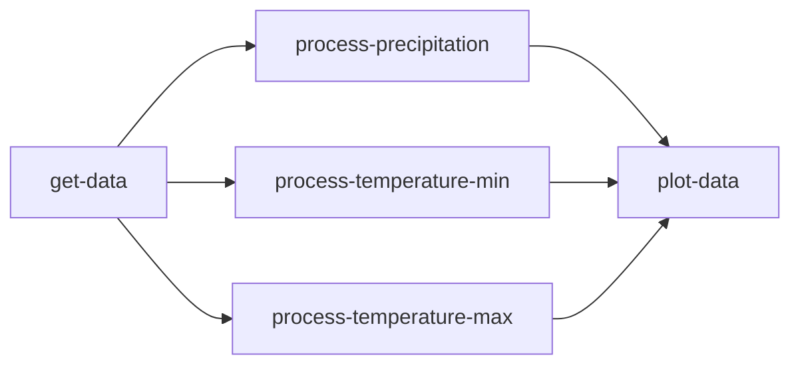
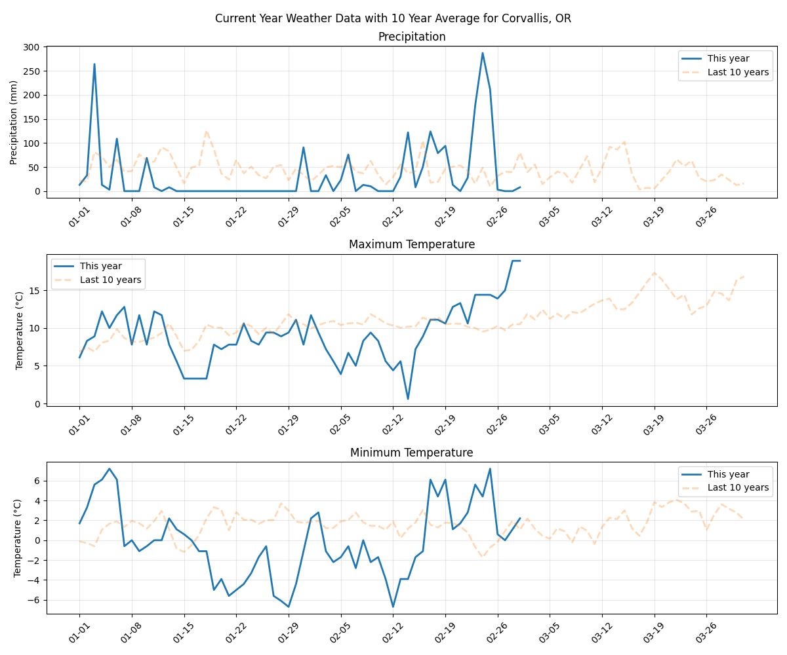

# Weather Visualization Workflow

The Weather Visualization Workflow is an example of a common FaaSr use case. It pulls data from the NOAA Global Historical Climatology Network Daily (GHCND) dataset, processes the data, and creates a visualization that is uploaded to S3.



Below is an example of the visualization we will be creating:



## Prerequisites

This tutorial...

## Understanding our Data

For this tutorial, we are working with the [NOAA Global Historical Climatology Network Daily (GHCND) dataset](https://www.ncei.noaa.gov/products/land-based-station/global-historical-climatology-network-daily). Full documentation for the dataset can be found here: [https://www.ncei.noaa.gov/data/global-historical-climatology-network-daily/doc/GHCND_documentation.pdf](https://www.ncei.noaa.gov/data/global-historical-climatology-network-daily/doc/GHCND_documentation.pdf).

This large dataset is segmented into CSV data from weather stations across the world, each of which are accessible from the base URL [https://www.ncei.noaa.gov/data/global-historical-climatology-network-daily/access/](https://www.ncei.noaa.gov/data/global-historical-climatology-network-daily/access/). For example:

```plaintext
Name            Last modified     Size
------------------------------------------
USC00351857.csv 2025-10-19 13:01  1610136
USC00351862.csv 2025-10-19 13:01  13115701
USC00351877.csv 2025-10-19 13:01  6200961
USC00351897.csv 2025-10-19 13:01  7349609
```

Inspecting a CSV file, we see columns with:

1. Metadata such as the station ID and station name
2. Daily weather observations like `PRCP` (precipitation), `TMIN` (minimum temperature), and `TMAX` (maximum temperature)
3. Metadata (measurement, quality, and source flags) about the daily observations, labeled as `..._ATTRIBUTES`

For this tutorial, we will be focusing on daily observations of precipitation and temperature to build our data visualization.

> ℹ️ A more sophisticated data analysis would consider the additional observation metadata, however this is out of scope for this tutorial.

## Writing our Functions

### 1. Get our Data

The first function in our workflow is tasked with getting our GHCND data. The complete function can be found in [01_get_data.py](./python/01_get_data.py)

First, we will write our imports:

- `requests`: We will use requests to download CSV data from a URL.
- `faasr_log`: This will write log outputs to S3.
- `faasr_put_file`: We will use this function for storing our CSV data on S3.

```python
import requests
from FaaSr_py.client.py_client_stubs import faasr_log, faasr_put_file
```

Next we need a function to build the URL that we will use for downloading the CSV. This will take our Station ID as an argument and return the complete URL.

```python
def build_url(station_id: str) -> str:
    """
    Build the URL for the NOAA Global Historical Climatology Network Daily (GHCND)
    dataset for a specific station.

    Args:
        station_id: The ID of the station to download the data from.

    Returns:
        The URL to download the data from.
    """
    base_url = "https://www.ncei.noaa.gov/data/global-historical-climatology-network-daily/access/"
    return f"{base_url}/{station_id}.csv"
```

We will write a single function for handling the CSV download using the `requests` library. This will receive the URL to download from and the name of the file to save the CSV data to. This will return an integer with the number of rows in the CSV.

```python
def download_data(url: str, output_name: str) -> str:
    """
    Download data from the NOAA Global Historical Climatology Network Daily (GHCND)
    dataset for a specific station and save it to a local file.

    Args:
        url: The URL to download the data from.
        output_name: The name of the file to save the data to.

    Returns:
        The number of rows downloaded.
    """
    try:
        response = requests.get(url, timeout=20)
        response.raise_for_status()

        with open(output_name, "w") as f:
            f.write(response.text)

        return len(response.text.split("\n")) - 1  # Subtract 1 for the header row

    except Exception as e:
        faasr_log(f"Error downloading data from {url}: {e}")
        raise e
```

> ℹ️ Note that we wrapped the download in a `try`/`except` block. This allows us to use `faasr_log` to record an error, simplifying troubleshooting if the download fails.

Finally, we can put everything together in a single function that:

1. Builds the URL
2. Downloads the CSV file to a local file
3. Uploads the file to the S3 bucket using `faasr_put_file`

This function will be called by FaaSr, so we will configure the `folder_name`, `output_name`, and `station_id` arguments when building our workflow.

```python
def get_ghcnd_data(folder_name: str, output_name: str, station_id: str):
    """
    Download data from the NOAA Global Historical Climatology Network Daily (GHCND)
    dataset for a specific station and upload it to an S3 bucket.

    Args:
        folder_name: The name of the folder to upload the data to.
        output_name: The name of the file to upload the data to.
        station_id: The ID of the station to download the data from.
    """

    # 1. Build the URL
    url = build_url(station_id)
    faasr_log(f"Downloading data from {url}")

    # 2. Download the file to a local file
    num_rows = download_data(url, output_name)
    faasr_log(f"Downloaded {num_rows} rows from {url}")

    # 3. Upload the file to the S3 bucket
    faasr_put_file(
        local_file=output_name,
        remote_folder=folder_name,
        remote_file=output_name,
    )

    faasr_log(f"Uploaded data to {folder_name}/{output_name}")
```

### 2. Process our Data

The second function in our workflow will handle processing the observations (precipitation, minimum temperature, and maximum temperature) that we are interested in. The complete function can be found in [02_process_data.py](./python/02_process_data.py).

First, we will define our imports, which now also include:

- `date`, `datetime`, and `timedelta` objects imported from the Python standard library for working with dates.
- `pandas`, a powerful library for working with tabular data.
- `faasr_get_file`, which we will use to download the CSV file created by our previous function.

```python
from datetime import date, datetime, timedelta

import pandas as pd
from FaaSr_py.client.py_client_stubs import faasr_get_file, faasr_log, faasr_put_file
```

Next we will define a function for getting our input data. This downloads the CSV file and returns it as a pandas DataFrame (See [What kind of data does pandas handle?](https://pandas.pydata.org/docs/getting_started/intro_tutorials/01_table_oriented.html) for more information). This function will receive the input `folder_name` and `input_name` as arguments.

```python
def get_input_data(folder_name: str, input_name: str) -> pd.DataFrame:
    """
    Get the input data from the FaaSr bucket and return it as a pandas DataFrame.

    Args:
        folder_name: The name of the folder to get the input data from.
        input_name: The name of the input file to get the data from.

    Returns:
        A pandas DataFrame containing the input data.
    """
    faasr_get_file(
        local_file=input_name,
        remote_folder=folder_name,
        remote_file=input_name,
    )
    return pd.read_csv(input_name)
```

We will be consistently working with date ranges while processing data, so we need a function that handles slicing a DataFrame by dates. This function will receive a DataFrame and start and end dates that we will use to return rows from the start date to the end data (inclusive).

```python
def slice_data_by_date(df: pd.DataFrame, start: str, end: str) -> pd.DataFrame:
    """
    Slice the data by date and return a new DataFrame.

    Args:
        df: A pandas DataFrame containing the data to slice.
        start: The start date to slice the data from.
        end: The end date to slice the data to.

    Returns:
        A pandas DataFrame containing the sliced data.
    """
    return df[(df["DATE"] >= start) & (df["DATE"] <= end)].copy()
```

> ℹ️ This function uses boolean indexing to locate all rows within a certain date range. For more details see [Indexing and selecting data](https://pandas.pydata.org/docs/user_guide/indexing.html).

Now we can start writing our logic for processing observation data. We will start with a function to process the current year's data. This will receive as arguments the DataFrame, name of the column we want to extract, and start and end dates. Since we are interested in the date only for comparison to previous years, we will create a `DAY` column that includes only the month and day of the `DATE` column.

```python
def process_current_year(
    df: pd.DataFrame,
    column_name: str,
    start: str,
    end: str,
) -> pd.DataFrame:
    """
    Process the current year data and return a DataFrame with the day of the year and
    the column value.

    Args:
        df: A pandas DataFrame containing the data to process.
        column_name: The name of the column to process.
        start: The start date to process the data from.
        end: The end date to process the data to.

    Returns:
        A pandas DataFrame containing the processed data.
    """
    current_year = slice_data_by_date(df, start, end)

    # Get only the day of the year and the column value
    current_year["DAY"] = current_year["DATE"].apply(lambda x: x[5:])
    return current_year[["DAY", column_name]]
```

The next function requires some added complexity to calculate the average observation values from the previous 10 years. To manage this, we take advantage of the datetime library to move our start and end dates to previous years and use `timedelta` to add 30 days to the tail of the previous years' averages. The `concat` and `groupby` functions in the pandas library allow us to concatenate all data from each year then calculate the mean for each day, which we then return as the final result.

```python
def process_previous_years(
    df: pd.DataFrame,
    column_name: str,
    start: str,
    end: str,
) -> pd.DataFrame:
    """
    Process the previous years data and return a DataFrame with the day of the year and
    the column value.

    Args:
        df: A pandas DataFrame containing the data to process.
        column_name: The name of the column to process.
        start: The start date to process the data from.
        end: The end date to process the data to.

    Returns:
        A pandas DataFrame containing the processed data.
    """

    # Get data for the same period + 30 days from the previous 10 years
    previous_years_data = []

    start_date = datetime.strptime(start, "%Y-%m-%d")
    end_date = datetime.strptime(end, "%Y-%m-%d")

    for year_offset in range(1, 11):
        # Get data for this year
        prev_start_date = date(
            year=start_date.year - year_offset,
            month=start_date.month,
            day=start_date.day,
        )

        prev_end_date = date(
            year=end_date.year - year_offset,
            month=end_date.month,
            day=end_date.day,
        ) + timedelta(days=30)  # Add 30 days to the end date

        year_data = slice_data_by_date(
            df,
            prev_start_date.strftime("%Y-%m-%d"),
            prev_end_date.strftime("%Y-%m-%d"),
        )

        # Convert date to MM-DD format for comparison
        year_data["DAY"] = year_data["DATE"].apply(lambda x: x[5:])
        previous_years_data.append(year_data[["DAY", column_name]])

    # Calculate the mean value for each day across previous years
    previous_years = pd.concat(previous_years_data, ignore_index=True)
    df = previous_years.groupby("DAY")[column_name].mean().reset_index()
    return df
```

> ℹ️ For more information on the `groupby` function, see [Group by: split-apply-combine](https://pandas.pydata.org/docs/user_guide/groupby.html).

As a final step, we will need to upload our processed data to S3. These two functions upload the current and previous years' averages, taking advantage of `to_csv` to save our DataFrames as CSV files before uploading.

```python
def upload_current_year_data(
    folder_name: str,
    output_name: str,
    current_year: pd.DataFrame,
) -> None:
    """
    Save the output data to a local file and upload it to the S3 bucket.

    Args:
        folder_name: The name of the folder to save the output data to.
        output_name: The name of the output file to save the data to.
        current_year: A pandas DataFrame containing the current year data.
    """
    current_year.to_csv(f"current_year_{output_name}", index=False)

    faasr_put_file(
        local_file=f"current_year_{output_name}",
        remote_folder=folder_name,
        remote_file=f"current_year_{output_name}",
    )


def upload_previous_years_data(
    folder_name: str,
    output_name: str,
    previous_years: pd.DataFrame,
) -> None:
    """
    Save the output data to a local file and upload it to the S3 bucket.

    Args:
        folder_name: The name of the folder to save the output data to.
        output_name: The name of the output file to save the data to.
        previous_years: A pandas DataFrame containing the previous years data.
    """
    previous_years.to_csv(f"previous_years_{output_name}", index=False)

    faasr_put_file(
        local_file=f"previous_years_{output_name}",
        remote_folder=folder_name,
        remote_file=f"previous_years_{output_name}",
    )
```

Finally, we will write the function to be run by FaaSr that will:

1. Get the input data.
2. Process the current year's data.
3. Process the previous years' averages.
4. Upload the output data.

```python
def compare_to_yearly_average(
    folder_name: str,
    input_name: str,
    output_name: str,
    column_name: str,
    start: str,
    end: str,
):
    """
    Compare the values for this year to the average of the same period + 30 days from
    the previous 10 years.

    Args:
        folder_name: The name of the folder to get the input data from.
        input_name: The name of the input file to get the data from.
        output_name: The name of the output file to save the data to.
        column_name: The name of the column to process.
        start: The start date to process the data from.
        end: The end date to process the data to.
    """
    # 1. Get the input data
    df = get_input_data(folder_name, input_name)
    faasr_log(f"Loaded input data from {folder_name}/{input_name} with {len(df)} rows")

    # 2. Process the current year data
    current_year = process_current_year(df, column_name, start, end)
    faasr_log("Processed current year data")

    # 3. Process the previous years data
    previous_years = process_previous_years(df, column_name, start, end)
    faasr_log("Processed previous years data")

    # 4. Upload the output data
    upload_current_year_data(folder_name, output_name, current_year)
    faasr_log(f"Uploaded data to {folder_name}/current_year_{output_name}")

    upload_previous_years_data(folder_name, output_name, previous_years)
    faasr_log(f"Uploaded data to {folder_name}/previous_years_{output_name}")
```

### 3. Plot our Data

Our third and final function in this workflow will plot the data we processed in previous steps. The complete function can be found in [03_plot_data.py](./python/03_plot_data.py).
