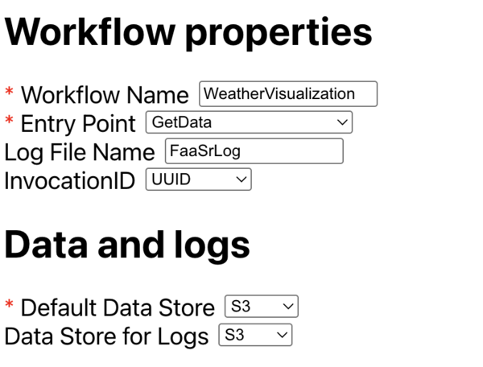

# Weather Visualization Workflow

## Table of Contents

- [Introduction](#introduction)
- [Prerequisites](#prerequisites)
- [Understanding our Data](#understanding-our-data)
- [Writing our Functions](#writing-our-functions)
  - [1. Get our Data](#1-get-our-data)
  - [2. Process our Data](#2-process-our-data)
  - [3. Plot our Data](#3-plot-our-data)

## Introduction

The Weather Visualization Workflow is an example of a common FaaSr use case. It pulls data from the NOAA Global Historical Climatology Network Daily (GHCND) dataset, processes the data, and creates a visualization that is uploaded to S3.


Below is an example of the visualization we will be creating:


## Prerequisites

This tutorial...

## Understanding our Data

For this tutorial, we are working with the [NOAA Global Historical Climatology Network Daily (GHCND) dataset](https://www.ncei.noaa.gov/products/land-based-station/global-historical-climatology-network-daily). Full documentation for the dataset can be found here: [https://www.ncei.noaa.gov/data/global-historical-climatology-network-daily/doc/GHCND_documentation.pdf](https://www.ncei.noaa.gov/data/global-historical-climatology-network-daily/doc/GHCND_documentation.pdf).

This large dataset is segmented into CSV data from weather stations across the world, each of which are accessible from the base URL [https://www.ncei.noaa.gov/data/global-historical-climatology-network-daily/access/](https://www.ncei.noaa.gov/data/global-historical-climatology-network-daily/access/). For example:

```plaintext
Name            Last modified     Size
------------------------------------------
USC00351857.csv 2025-10-19 13:01  1610136
USC00351862.csv 2025-10-19 13:01  13115701
USC00351877.csv 2025-10-19 13:01  6200961
USC00351897.csv 2025-10-19 13:01  7349609
```

Inspecting a CSV file, we see columns with:

1. Metadata such as the station ID and station name.
2. Daily weather observations like `PRCP` (precipitation), `TMIN` (minimum temperature), and `TMAX` (maximum temperature).
3. Metadata (measurement, quality, and source flags) about the daily observations, labeled as `..._ATTRIBUTES`.

> ℹ️ A more sophisticated data analysis would consider the additional observation metadata, however this is out of scope for this tutorial.

For this tutorial, we will be focusing on daily observations of precipitation and temperature to build our data visualization.

For this tutorial we will be using the Corvallis, OR (Oregon State University) station data (`USC00351862`). A complete list of weather stations and their IDs in this dataset can be found here: [https://www.ncei.noaa.gov/pub/data/ghcn/daily/ghcnd-stations.txt](https://www.ncei.noaa.gov/pub/data/ghcn/daily/ghcnd-stations.txt).

## Writing our Functions

### 1. Get our Data

The first function in our workflow is tasked with getting our GHCND data. The complete function can be found in [01_get_data.py](./python/01_get_data.py).

First, we will write our imports:

- `requests`: We will use requests to download CSV data from a URL.
- `faasr_log`: This will write log outputs to S3.
- `faasr_put_file`: We will use this function for storing our CSV data on S3.

```python
import requests
from FaaSr_py.client.py_client_stubs import faasr_log, faasr_put_file
```

Next we need a function to build the URL that we will use for downloading the CSV. This will take our Station ID as an argument and return the complete URL.

```python
def build_url(station_id: str) -> str:
    """
    Build the URL for the NOAA Global Historical Climatology Network Daily (GHCND)
    dataset for a specific station.

    Args:
        station_id: The ID of the station to download the data from.

    Returns:
        The URL to download the data from.
    """
    base_url = "https://www.ncei.noaa.gov/data/global-historical-climatology-network-daily/access/"
    return f"{base_url}/{station_id}.csv"
```

We will write a single function for handling the CSV download using the `requests` library. This will receive the URL to download from and the name of the file to save the CSV data to. This will return an integer with the number of rows in the CSV.

> ℹ️ Note that we wrapped the download in a `try`/`except` block. This allows us to use `faasr_log` to record an error, simplifying troubleshooting if the download fails.

```python
def download_data(url: str, output_name: str) -> str:
    """
    Download data from the NOAA Global Historical Climatology Network Daily (GHCND)
    dataset for a specific station and save it to a local file.

    Args:
        url: The URL to download the data from.
        output_name: The name of the file to save the data to.

    Returns:
        The number of rows downloaded.
    """
    try:
        response = requests.get(url, timeout=20)
        response.raise_for_status()

        with open(output_name, "w") as f:
            f.write(response.text)

        return len(response.text.split("\n")) - 1  # Subtract 1 for the header row

    except Exception as e:
        faasr_log(f"Error downloading data from {url}: {e}")
        raise e
```

Finally, we can put everything together in a single function that:

1. Builds the URL.
2. Downloads the CSV file to a local file.
3. Uploads the file to the S3 bucket using `faasr_put_file`.

This function will be called by FaaSr, so we will configure the `folder_name`, `output_name`, and `station_id` arguments when building our workflow.

```python
def get_ghcnd_data(folder_name: str, output_name: str, station_id: str):
    """
    Download data from the NOAA Global Historical Climatology Network Daily (GHCND)
    dataset for a specific station and upload it to an S3 bucket.

    Args:
        folder_name: The name of the folder to upload the data to.
        output_name: The name of the file to upload the data to.
        station_id: The ID of the station to download the data from.
    """

    # 1. Build the URL
    url = build_url(station_id)
    faasr_log(f"Downloading data from {url}")

    # 2. Download the file to a local file
    num_rows = download_data(url, output_name)
    faasr_log(f"Downloaded {num_rows} rows from {url}")

    # 3. Upload the file to the S3 bucket
    faasr_put_file(
        local_file=output_name,
        remote_folder=folder_name,
        remote_file=output_name,
    )

    faasr_log(f"Uploaded data to {folder_name}/{output_name}")
```

### 2. Process our Data

The second function in our workflow will handle processing the observations (precipitation, minimum temperature, and maximum temperature) that we are interested in. The complete function can be found in [02_process_data.py](./python/02_process_data.py).

First, we will define our imports, which now also include:

- `date`, `datetime`, and `timedelta` objects imported from the Python standard library for working with dates.
- `pandas`, a powerful library for working with tabular data.
- `faasr_get_file`, which we will use to download the CSV file created by our previous function.

```python
from datetime import date, datetime, timedelta

import pandas as pd
from FaaSr_py.client.py_client_stubs import faasr_get_file, faasr_log, faasr_put_file
```

Next we will define a function for getting our input data. This downloads the CSV file and returns it as a pandas DataFrame (See [What kind of data does pandas handle?](https://pandas.pydata.org/docs/getting_started/intro_tutorials/01_table_oriented.html) for more information). This function will receive the input `folder_name` and `input_name` as arguments.

```python
def get_input_data(folder_name: str, input_name: str) -> pd.DataFrame:
    """
    Get the input data from the FaaSr bucket and return it as a pandas DataFrame.

    Args:
        folder_name: The name of the folder to get the input data from.
        input_name: The name of the input file to get the data from.

    Returns:
        A pandas DataFrame containing the input data.
    """
    faasr_get_file(
        local_file=input_name,
        remote_folder=folder_name,
        remote_file=input_name,
    )
    return pd.read_csv(input_name)
```

We will be consistently working with date ranges while processing data, so we need a function that handles slicing a DataFrame by dates. This function will receive a DataFrame and start and end dates that we will use to return rows from the start date to the end data (inclusive).

> ℹ️ This function uses boolean indexing to locate all rows within a certain date range. For more details see [Indexing and selecting data](https://pandas.pydata.org/docs/user_guide/indexing.html).

```python
def slice_data_by_date(df: pd.DataFrame, start: str, end: str) -> pd.DataFrame:
    """
    Slice the data by date and return a new DataFrame.

    Args:
        df: A pandas DataFrame containing the data to slice.
        start: The start date to slice the data from.
        end: The end date to slice the data to.

    Returns:
        A pandas DataFrame containing the sliced data.
    """
    return df[(df["DATE"] >= start) & (df["DATE"] <= end)].copy()
```

Now we can start writing our logic for processing observation data. We will start with a function to process the current year's data. This will receive as arguments the DataFrame, name of the column we want to extract, and start and end dates. Since we are interested in the date only for comparison to previous years, we will create a `DAY` column that includes only the month and day of the `DATE` column.

> ℹ️ This function uses `apply` for efficient operations on DataFrames. For more information refer to the [pandas documentation](https://pandas.pydata.org/docs/reference/api/pandas.DataFrame.apply.html).

```python
def process_current_year(
    df: pd.DataFrame,
    column_name: str,
    start: str,
    end: str,
) -> pd.DataFrame:
    """
    Process the current year data and return a DataFrame with the day of the year and
    the column value.

    Args:
        df: A pandas DataFrame containing the data to process.
        column_name: The name of the column to process.
        start: The start date to process the data from.
        end: The end date to process the data to.

    Returns:
        A pandas DataFrame containing the processed data.
    """
    current_year = slice_data_by_date(df, start, end)

    # Get only the day of the year and the column value
    current_year["DAY"] = current_year["DATE"].apply(lambda x: x[5:])
    return current_year[["DAY", column_name]]
```

The next function requires some added complexity to calculate the average observation values from the previous 10 years. To manage this, we take advantage of the datetime library to move our start and end dates to previous years and use `timedelta` to add 30 days to the tail of the previous years' averages. The `concat` and `groupby` functions in the pandas library allow us to concatenate all data from each year then calculate the mean for each day, which we then return as the final result.

> ℹ️ For more information on the `groupby` function, see [Group by: split-apply-combine](https://pandas.pydata.org/docs/user_guide/groupby.html).

```python
def process_previous_years(
    df: pd.DataFrame,
    column_name: str,
    start: str,
    end: str,
) -> pd.DataFrame:
    """
    Process the previous years data and return a DataFrame with the day of the year and
    the column value.

    Args:
        df: A pandas DataFrame containing the data to process.
        column_name: The name of the column to process.
        start: The start date to process the data from.
        end: The end date to process the data to.

    Returns:
        A pandas DataFrame containing the processed data.
    """

    # Get data for the same period + 30 days from the previous 10 years
    previous_years_data = []

    start_date = datetime.strptime(start, "%Y-%m-%d")
    end_date = datetime.strptime(end, "%Y-%m-%d")

    for year_offset in range(1, 11):
        # Get data for this year
        prev_start_date = date(
            year=start_date.year - year_offset,
            month=start_date.month,
            day=start_date.day,
        )

        prev_end_date = date(
            year=end_date.year - year_offset,
            month=end_date.month,
            day=end_date.day,
        ) + timedelta(days=30)  # Add 30 days to the end date

        year_data = slice_data_by_date(
            df,
            prev_start_date.strftime("%Y-%m-%d"),
            prev_end_date.strftime("%Y-%m-%d"),
        )

        # Convert date to MM-DD format for comparison
        year_data["DAY"] = year_data["DATE"].apply(lambda x: x[5:])
        previous_years_data.append(year_data[["DAY", column_name]])

    # Calculate the mean value for each day across previous years
    previous_years = pd.concat(previous_years_data, ignore_index=True)
    df = previous_years.groupby("DAY")[column_name].mean().reset_index()
    return df
```

As a final step, we will need to upload our processed data to S3. These two functions upload the current and previous years' averages, taking advantage of `to_csv` to save our DataFrames as CSV files before uploading.

> ℹ️ `to_csv` handles much of the complexity of converting our data to a CSV file. For more information refer to the [pandas documentation](https://pandas.pydata.org/docs/reference/api/pandas.DataFrame.to_csv.html).

```python
def upload_current_year_data(
    folder_name: str,
    output_name: str,
    current_year: pd.DataFrame,
) -> None:
    """
    Save the output data to a local file and upload it to the S3 bucket.

    Args:
        folder_name: The name of the folder to save the output data to.
        output_name: The name of the output file to save the data to.
        current_year: A pandas DataFrame containing the current year data.
    """
    current_year.to_csv(f"current_year_{output_name}", index=False)

    faasr_put_file(
        local_file=f"current_year_{output_name}",
        remote_folder=folder_name,
        remote_file=f"current_year_{output_name}",
    )


def upload_previous_years_data(
    folder_name: str,
    output_name: str,
    previous_years: pd.DataFrame,
) -> None:
    """
    Save the output data to a local file and upload it to the S3 bucket.

    Args:
        folder_name: The name of the folder to save the output data to.
        output_name: The name of the output file to save the data to.
        previous_years: A pandas DataFrame containing the previous years data.
    """
    previous_years.to_csv(f"previous_years_{output_name}", index=False)

    faasr_put_file(
        local_file=f"previous_years_{output_name}",
        remote_folder=folder_name,
        remote_file=f"previous_years_{output_name}",
    )
```

Finally, we will write the function to be run by FaaSr that will:

1. Get the input data.
2. Process the current year's data.
3. Process the previous years' averages.
4. Upload the output data.

```python
def compare_to_yearly_average(
    folder_name: str,
    input_name: str,
    output_name: str,
    column_name: str,
    start: str,
    end: str,
):
    """
    Compare the values for this year to the average of the same period + 30 days from
    the previous 10 years.

    Args:
        folder_name: The name of the folder to get the input data from.
        input_name: The name of the input file to get the data from.
        output_name: The name of the output file to save the data to.
        column_name: The name of the column to process.
        start: The start date to process the data from.
        end: The end date to process the data to.
    """
    # 1. Get the input data
    df = get_input_data(folder_name, input_name)
    faasr_log(f"Loaded input data from {folder_name}/{input_name} with {len(df)} rows")

    # 2. Process the current year data
    current_year = process_current_year(df, column_name, start, end)
    faasr_log("Processed current year data")

    # 3. Process the previous years data
    previous_years = process_previous_years(df, column_name, start, end)
    faasr_log("Processed previous years data")

    # 4. Upload the output data
    upload_current_year_data(folder_name, output_name, current_year)
    faasr_log(f"Uploaded data to {folder_name}/current_year_{output_name}")

    upload_previous_years_data(folder_name, output_name, previous_years)
    faasr_log(f"Uploaded data to {folder_name}/previous_years_{output_name}")
```

### 3. Plot our Data

Our third and final function in this workflow will plot the data we processed in previous steps. The complete function can be found in [03_plot_data.py](./python/03_plot_data.py).

First, we will define our imports, adding `matplotlib` as our library for creating the visualization:

```python
import matplotlib.pyplot as plt
import pandas as pd
from FaaSr_py.client.py_client_stubs import faasr_get_file, faasr_log, faasr_put_file
from matplotlib.axes import Axes
```

Similar to our previous function, we will start with defining a function for downloading our input data:

```python
def get_input_data(
    folder_name: str,
    input_name: str,
) -> tuple[pd.DataFrame, pd.DataFrame]:
    """
    Get the input data from the FaaSr bucket and return it as a pandas DataFrame.

    Args:
        folder_name: The name of the folder to get the input data from.
        input_name: The name of the input file to get the data from.

    Returns:
        A tuple containing the current year data and the previous years data.
    """
    faasr_get_file(
        local_file=f"current_year_{input_name}",
        remote_folder=folder_name,
        remote_file=f"current_year_{input_name}",
    )

    faasr_get_file(
        local_file=f"previous_years_{input_name}",
        remote_folder=folder_name,
        remote_file=f"previous_years_{input_name}",
    )

    current_year_data = pd.read_csv(f"current_year_{input_name}")
    previous_years_data = pd.read_csv(f"previous_years_{input_name}")

    return current_year_data, previous_years_data
```

Before plotting our data, we need to perform a few operations to prepare it for visualization. First, we will use `merge` to combine our current and previous years' data. The dataset we are using in this example reports temperature in tenths of a degree Celsius, so we will transform our temperature observation columns to whole degrees Celsius. Finally, we also drop leap days.

> ℹ️ For more information on merging and joining DataFrames, see [Merge, join, concatenate, and compare](https://pandas.pydata.org/docs/user_guide/merging.html).

```python
def prepare_data(
    current_year_precip: pd.DataFrame,
    current_year_min_temp: pd.DataFrame,
    current_year_max_temp: pd.DataFrame,
    prev_years_precip: pd.DataFrame,
    prev_years_min_temp: pd.DataFrame,
    prev_years_max_temp: pd.DataFrame,
) -> tuple[pd.DataFrame, pd.DataFrame]:
    """
    Prepare the data for plotting.

    Args:
        current_year_precip: The current year precipitation data.
        current_year_min_temp: The current year minimum temperature data.
        current_year_max_temp: The current year maximum temperature data.
        prev_years_precip: The previous years precipitation data.
        prev_years_min_temp: The previous years minimum temperature data.
        prev_years_max_temp: The previous years maximum temperature data.

    Returns:
        A tuple containing the current year data and the previous years data.
    """

    # Merge the dataframes on the DAY column
    current_year = current_year_precip.merge(current_year_min_temp, on="DAY")
    current_year = current_year.merge(current_year_max_temp, on="DAY")
    prev_years = prev_years_precip.merge(prev_years_min_temp, on="DAY")
    prev_years = prev_years.merge(prev_years_max_temp, on="DAY")

    # Convert temperature from tenths of degrees Celsius to degrees Celsius
    current_year["TMAX"] = current_year["TMAX"] / 10
    current_year["TMIN"] = current_year["TMIN"] / 10
    prev_years["TMAX"] = prev_years["TMAX"] / 10
    prev_years["TMIN"] = prev_years["TMIN"] / 10

    # Drop leap days
    current_year = current_year[current_year["DAY"] != "02-29"]
    prev_years = prev_years[prev_years["DAY"] != "02-29"]

    return current_year, prev_years
```

Since our visualization includes a unique subplot for each visualization, we will write a helper function that creates a subplot for given data. This will take the `Axes` of the subplot we are creating and the `x` and `y` data for current and previous years. We will use the `title` and `ylabel` arguments to distinguish the units and data we are plotting.

To distinguish current and previous years' data, we modify the `alpha` and `linestyle` properties of the previous years' data. As a final step we also modify the x-axis ticks to display every 7th day only.

> ℹ️ To see a robust catalog of operations you can perform on a subplot in matplotlib, see [Subplots, axes and figures](https://matplotlib.org/stable/gallery/subplots_axes_and_figures/index.html).

```python
def plot_subplot(
    ax: Axes,
    x_data: pd.Series,
    y_data: pd.Series,
    prev_years_x_data: pd.Series,
    prev_years_y_data: pd.Series,
    title: str,
    ylabel: str,
) -> None:
    """
    Plot a subplot with the given data. Current year data is plotted with 100% opacity
    and previous years data is plotted with 30% opacity.

    Args:
        ax: The axes to plot the data on.
        x_data: The x-axis data.
        y_data: The y-axis data.
        prev_years_x_data: The x-axis data for the previous years.
        prev_years_y_data: The y-axis data for the previous years.
        title: The title of the subplot.
        ylabel: The label for the y-axis.
    """
    # Create the plot for the current year
    ax.plot(
        x_data,
        y_data,
        alpha=1.0,
        label="This year",
        linewidth=2,
    )

    # Create the plot for the previous years
    ax.plot(
        prev_years_x_data,
        prev_years_y_data,
        alpha=0.3,
        label="Last 10 years",
        linewidth=2,
        linestyle="--",
    )

    # Set the title and y-axis label
    ax.set_title(title)
    ax.set_ylabel(ylabel)
    ax.legend()
    ax.grid(True, alpha=0.3)

    # Set the x-axis ticks to every 7th day
    tick_positions = prev_years_x_data[::7]
    ax.set_xticks(tick_positions)
    ax.tick_params(axis="x", rotation=45)
```

Finally, we will write our FaaSr function that:

1. Gets the input data.
2. Prepares the data for plotting.
3. Creates the figure with three subplots.
4. Saves the plot to a file and uploads it to S3.

Here, we use `plt.subplots` to create a figure with three subplots. The axes of these subplots (`ax1`, `ax2`, and `ax3`) are what we pass to the previous function we wrote.

> ℹ️ For more information on working with subplots in matplotlib, see [Create multiple subplots using `plt.subplots`](https://matplotlib.org/stable/gallery/subplots_axes_and_figures/subplots_demo.html).

```python
def plot_weather_comparison(
    folder_name: str,
    input_precip_name: str,
    input_min_temp_name: str,
    input_max_temp_name: str,
    location: str,
    output_name: str,
):
    """
    Create a combined plot with three subplots: precipitation, min temp, and max temp.

    Args:
        folder_name: The name of the folder to get the input data from.
        input_precip_name: The name of the input file to get the precipitation data from.
        input_min_temp_name: The name of the input file to get the minimum temperature data from.
        input_max_temp_name: The name of the input file to get the maximum temperature data from.
        location: The location of the weather data.
        output_name: The name of the output file to save the plot to.
    """

    # 1. Get the input data
    current_year_precip, prev_years_precip = get_input_data(
        folder_name,
        input_precip_name,
    )

    faasr_log(f"Loaded precipitation data from {folder_name}/{input_precip_name}")

    current_year_min_temp, prev_years_min_temp = get_input_data(
        folder_name,
        input_min_temp_name,
    )

    faasr_log(
        f"Loaded minimum temperature data from {folder_name}/{input_min_temp_name}"
    )

    current_year_max_temp, prev_years_max_temp = get_input_data(
        folder_name,
        input_max_temp_name,
    )

    faasr_log(
        f"Loaded maximum temperature data from {folder_name}/{input_max_temp_name}"
    )

    # 2. Prepare the data for plotting
    current_year, prev_years = prepare_data(
        current_year_precip,
        current_year_min_temp,
        current_year_max_temp,
        prev_years_precip,
        prev_years_min_temp,
        prev_years_max_temp,
    )

    faasr_log("Prepared data for plotting")

    # 3. Create the figure with 3 subplots
    _, (ax1, ax2, ax3) = plt.subplots(3, 1, figsize=(12, 10))
    plt.suptitle(f"Current Year Weather Data with 10 Year Average for {location}")

    # Precipitation subplot
    plot_subplot(
        ax=ax1,
        x_data=current_year["DAY"],
        y_data=current_year["PRCP"],
        prev_years_x_data=prev_years["DAY"],
        prev_years_y_data=prev_years["PRCP"],
        title="Precipitation",
        ylabel="Precipitation (mm)",
    )

    faasr_log("Plotted precipitation subplot")

    # Maximum temperature subplot
    plot_subplot(
        ax=ax2,
        x_data=current_year["DAY"],
        y_data=current_year["TMAX"],
        prev_years_x_data=prev_years["DAY"],
        prev_years_y_data=prev_years["TMAX"],
        title="Maximum Temperature",
        ylabel="Temperature (°C)",
    )

    faasr_log("Plotted maximum temperature subplot")

    # Minimum temperature subplot
    plot_subplot(
        ax=ax3,
        x_data=current_year["DAY"],
        y_data=current_year["TMIN"],
        prev_years_x_data=prev_years["DAY"],
        prev_years_y_data=prev_years["TMIN"],
        title="Minimum Temperature",
        ylabel="Temperature (°C)",
    )

    faasr_log("Plotted minimum temperature subplot")

    # 4. Save the plot to a file and upload it to the S3 bucket
    plt.tight_layout()
    plt.savefig(output_name)
    plt.close()

    faasr_put_file(
        local_file=output_name,
        remote_folder=folder_name,
        remote_file=output_name,
    )

    faasr_log(f"Uploaded plot to {folder_name}/{output_name}")
```

## Building our Workflow

Now that we wrote our three functions, we are ready to start building our workflow using the FaaSr Workflow Builder: [https://faasr.io/FaaSr-workflow-builder/](https://faasr.io/FaaSr-workflow-builder/).

The final workflow file that we will create can be found in [weather_visualization_py.json](../weather_visualization_py.json). Before getting started, you can visualize this workflow by clicking **Upload** from the Workflow Builder and either uploading the file or importing from its GitHub URL: [https://github.com/JStover95/FaaSr-Functions/blob/main/weather_visualization_py.json](https://github.com/JStover95/FaaSr-Functions/blob/main/weather_visualization_py.json).

> ℹ️ As you make changes to your workflow, you can click the **vertical layout** or **horizontal layout** controls at the top of the right-hand layout view to re-arrange the layout with your changes.

### 1. Set Up our Compute Server

After opening the Workflow Builder, we will first add a compute server. This can be one of GitHub Actions, AWS Lambda, or more (see the documentation for more details ...). For this tutorial, we will use GitHub Actions.

Click **Edit Compute Servers** and enter the information for the GitHub repository that you want to run the actions on. For example:


### 2. Set Up our Data Store

Click **Edit Data Stores**. Then , enter the endpoint, bucket, and region for your data store. This can be the same as what you used when following the tutorial.

The workflow is set up to use an AWS S3 bucket in the region `us-east-1` by default:


### 3. Add our Functions

#### Get Data Function

Navigate back to **Edit Actions/Functions** and find the field labeled **Start typing to create a new action...**, then enter `GetData` and press Enter.


With the function created, we can begin configuring it. For **Function Name**, enter the name of the function we created in [1. Get our Data](#1-get-our-data): `get_ghcnd_data`. For **Language**, select **Python**, and for **Compute Server**, ensure it is set to the default **GH** that we created in [1. Set Up our Computer Server](#1-set-up-our-compute-server).

> ⚠️ Notice here that `get_ghcnd_data` is the _Function Name_ (the name of the actual Python function that FaaSr will run), while `GetData` is the _Action ID_ (the unique identifier that FaaSr will use for orchestrating the workflow).

Your configuration should appear as below:


To add arguments to the function, click **Add New Arguments** under the **Arguments** header. In the popup window enter the following argument names and values:

- `folder_name`: weather-visualization
- `output_name`: weather-data.csv
- `station_id`: USC00351862

> ℹ️ `USC00351862` is the ID of the Oregon State University station in Corvallis, OR. For information on finding a different Station ID, see [Understanding our Data](#understanding-our-data)

You should see the arguments entered as below:


Next, for **Function's Git Repo/Path**, enter the Git repository name and folder that contains the Python files we created in [Writing our Functions](#writing-our-functions). For example: `JStover95/FaaSr-Functions/weather_visualization/python`. Leave **Function's Action Container** blank to use the default container.

> ℹ️ This is the Docker container that will run the FaaSr framework and invoke our functions. It is possible to use your own container here, but is only recommended for very advanced use cases and an in-depth knowledge of Docker.

#### Data Processing Functions

Next we will create three functions for processing our data, one for each variable that we are interested in (precipitation, minimum temperature, and maximum temperature).

Create a new function called `ProcessPrecipitation`. For **Function Name** enter the name of the function we created in [2. Process our Data](#2-process-our-data): `compare_to_yearly_average`. Set **Language** and **Compute Server** to **Python** and **GH**.

Next, add our arguments:

- `folder_name`: weather-visualization
- `input_name`: weather-data.csv
- `output_name`: precipitation-data.csv
- `column_name`: PRCP
- `start`: 2025-01-01
- `end`: 2025-03-01

Now, set **Function's Git Repo/Path** to `JStover95/FaaSr-Functions/weather_visualization/python` and leave **Function's Action Container** blank.

Because our function uses the pandas library, we must add it to the function. Under **Python Packages for the Function**, enter `pandas` in the **NewPackageName** field and click **Add Package**.

> ℹ️ FaaSr will always install the latest version of Python packages. It recommended to write your code with the latest available versions to avoid any conflicts with old package versions.

Your Python packages should appear as below:


With our Process Precipitation function created, we can simplify the creation of the same function for minimum and maximum temperature using the Workflow Builder's duplicate action feature. Scroll to the top of the left-hand menu to find the **Duplicate Action** field, enter `ProcessTemperatureMin`, and click **Duplicate Action**:


For the duplicated action, the only configuration we must change are the `output_name` and `column_name` arguments. Everything else can remain exactly the same, since FaaSr will run the exact same function:

- `output_name`: temperature-min-data.csv
- `column_name`: TMIN

Finally, duplicate the action once more, naming the next function `ProcessTemperatureMax` and change the arguments accordingly:

- `output_name`: temperature-max-data.csv
- `column_name`: TMAX

#### Plot Data Function

Finally we will create the function for plotting our data. Create a new function called `PlotData`. Use the same configuration as our previous functions with the following differences:

For **Function Name** enter the name of the function we created in [3. Plot our Data](#3-plot-our-data): `plot_weather_comparison`.

Enter the following arguments:

- `folder_name`: weather-visualization
- `input_precip_name`: precipitation-data.csv
- `input_min_temp_name`: temperature-min-data.csv
- `input_max_temp_name`: temperature-max-data.csv
- `location`: Corvallis, OR
  - You may change this location depending on which Station ID you decided to use in the Get Data function.
- `output_name`: weather-comparison.png

For Python packages, enter both `pandas` and `matplotlib`.

### 4. Connect our Functions

Our workflow's functions are configured, so our next step is to define its invocation paths. Navigate to our Get Data function, either by clicking it in the right-hand layout view or selecting it from the dropdown at the top of the left-hand menu.

Scroll to **Next Actions to Invoke**, click **Add New InvokeNext**, and use the popup menu to connect the Get Data function with our Data Processing functions. With the leftmost dropdown menu, select `ProcessPrecipitation`, leave the remaining options unchanged, and click **Add New InvokeNext**.

> ℹ️ This popup menu also allows us to define rank (parallel execution) and conditional invocation (depending on whether a function returns `true` or `false`). These are not in this tutorial, but refer to the documentation for more information ...

Repeat this for our other Data Processing functions `ProcessTemperatureMin` and `ProcessTemperatureMax`. Our next invocations should now appear as below:


Now, repeat this process to connect each of our Data Processing functions to our Plot Data function. From each, click **Add New InvokeNext**, and from the dropdown menu select `PlotData`.

### 5. Finalize our Workflow Configuration

Our final step is to finalize our workflow configuration. Click **Workflow Settings**, then for **Workflow Name** enter `WeatherVisualizationWorkflow` and for **Entry Point** select `GetData`. Leave the remaining configuration as default.

> ℹ️ **Entry Point** is the first function we want to invoke in or workflow.
> ℹ️ Refer to the documentation (...) for more details on the other configuration options in this menu.

Your workflow settings should appear as below:



## Download and Invoke our Workflow

With our workflow complete, click the **vertical layout** control at the top of the right-hand layout view to see our changes. The complete workflow should appear as below:


Click on **Download** and click the **Download WeatherVisualizationWorkflow.json** button in the popup menu.

> ℹ️ It is possible to also download a particular Workflow Builder layout, in case it is necessary to share the particular layout with others on your team.
